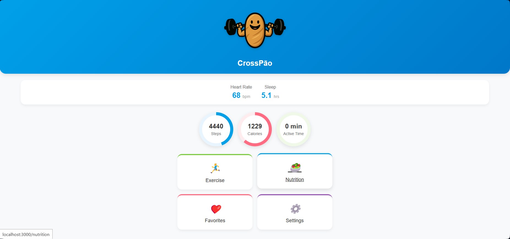

# Projeto: CrossPão

Acesso: [https://web-t2.rodrigoappelt.com](https://web-t2.rodrigoappelt.com)

## Desenvolvedores

Rafael Carneiro Pregardier e Rodrigo Appelt

## Nosso produto

A plataforma desenvolvida (CrossPão) é um centralizador de diversas atividades voltadas para a saúde, com o foco em exercícios e dicas de nutrição. Conta com _features_ de listar e favoritar exercícios, timer para suas atividades e personalização do seu perfil!

## Desenvolvimento

## Tecnologias

* Create React App
* Node.js
* Vercel
* React
* Html
* Css

## Ambiente de Desenvolvimento

* Visual Studio Code e extensões
* NPM

## Referências e Créditos

* Github copilot

---

Projeto entregue para a disciplina de Desenvolvimento de Software para a Web em 2025a
